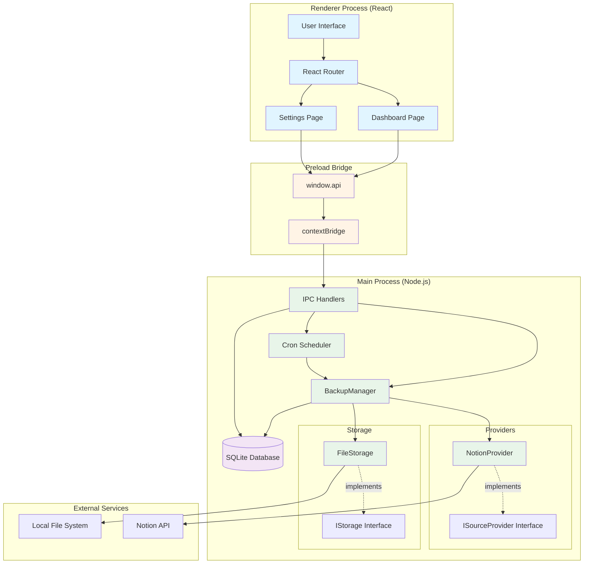
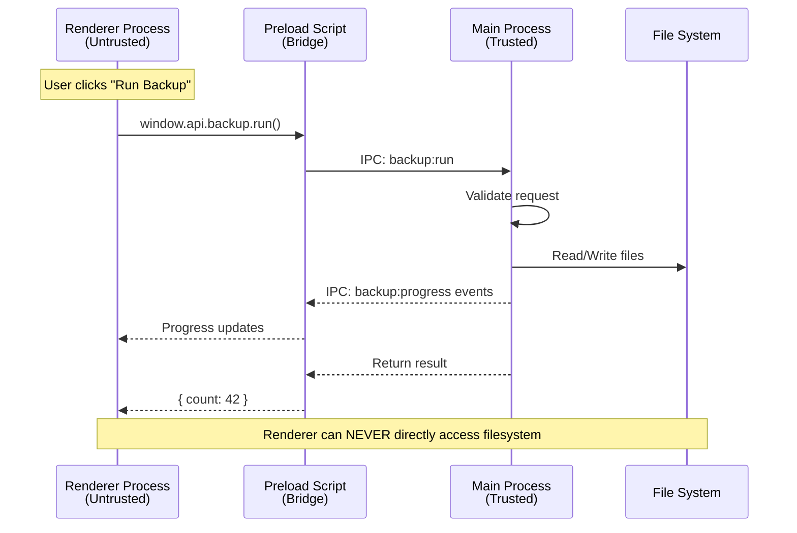
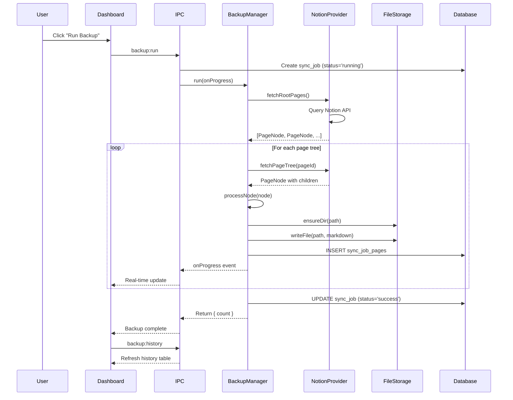
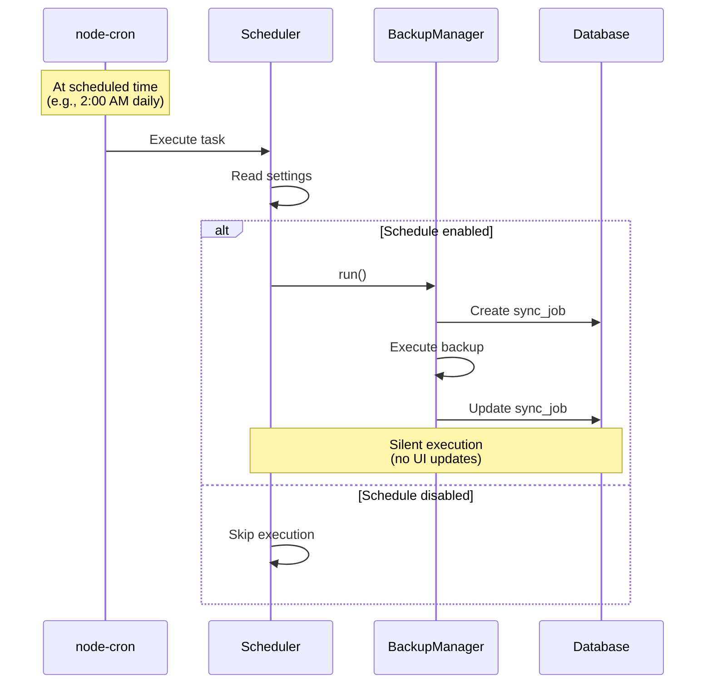

# Architecture Overview

## Introduction

Notion Backup MD is an **Electron + React + TypeScript** desktop application that backs up Notion pages as local Markdown files. The application features scheduled backup automation, a clean UI dashboard, and a plugin-like architecture for extensibility.

## High-Level Architecture

The application follows Electron's multi-process architecture with strict separation between the main process (Node.js backend) and renderer process (React frontend).



## Process Separation

Electron applications run in two distinct processes for security and stability:

| Process | Path | Responsibilities | Restrictions |
|---------|------|------------------|--------------|
| **Main Process** | `src/main/` | File I/O, SQLite, Notion API, IPC handlers, cron scheduler | Full Node.js access |
| **Preload** | `src/preload/index.ts` | Bridges main and renderer processes via `contextBridge` | Limited, secure API exposure |
| **Renderer Process** | `src/renderer/src/` | UI only (React components) | **NO** direct Node.js, filesystem, or database access |

### Security Model



**Key Principle**: The renderer process operates in a sandboxed environment and can only perform operations explicitly exposed through the IPC contract defined in the preload script.

## Core Components

### 1. BackupManager

**Location**: `src/main/backup/BackupManager.ts`

**Purpose**: Orchestrates the backup process by coordinating content providers and storage backends.

**Responsibilities**:
- Create and track backup jobs in the database
- Recursively process page hierarchies
- Sanitize filenames for filesystem compatibility
- Emit progress events to the UI
- Handle errors gracefully

### 2. Source Providers (Strategy Pattern)

**Interface**: `ISourceProvider` (`src/main/backup/providers/ISourceProvider.ts`)

**Current Implementation**: `NotionProvider`

**Responsibilities**:
- Fetch content from external sources
- Convert content to Markdown format
- Build page hierarchies with parent-child relationships

**Extensibility**: New providers (Confluence, Google Workspace, etc.) can be added by implementing the `ISourceProvider` interface.

### 3. Storage Backends (Strategy Pattern)

**Interface**: `IStorage` (`src/main/backup/storage/IStorage.ts`)

**Current Implementation**: `FileStorage`

**Responsibilities**:
- Write Markdown files to destination
- Create directory structures
- Handle path sanitization

**Extensibility**: New storage backends (Google Drive, S3, Dropbox, etc.) can be added by implementing the `IStorage` interface.

### 4. Scheduler

**Location**: `src/main/scheduler/Scheduler.ts`

**Purpose**: Manages automated backups using cron expressions.

**Features**:
- Start scheduled tasks on application launch
- Dynamically reschedule when settings change
- Validate cron expressions before scheduling
- Execute silent background backups

### 5. Database Layer

**Location**: `src/main/db/`

**Components**:
- `index.ts`: SQLite connection singleton with WAL mode
- `migrations.ts`: Versioned schema migrations
- `settings.ts`: Type-safe key-value configuration store

## Data Flow

### Manual Backup Flow



### Scheduled Backup Flow



## Directory Structure & Page Hierarchy Mapping

Notion's hierarchical page structure is mapped to a local filesystem directory structure:

**Notion Workspace**:
```
Root Page
├── Child Page A
│   └── Grandchild Page
└── Child Page B
```

**Local Filesystem**:
```
/backup-root/
├── Root Page/
│   ├── root.md           ← Content of "Root Page"
│   ├── Child Page A/
│   │   ├── root.md       ← Content of "Child Page A"
│   │   └── Grandchild Page/
│   │       └── root.md   ← Content of "Grandchild Page"
│   └── Child Page B/
│       └── root.md       ← Content of "Child Page B"
```

**Naming Rules**:
- Directory names match page titles (sanitized)
- Page content stored as `root.md` within its directory
- Invalid filesystem characters removed: `/\:*?"<>|`
- Length limited to 200 characters
- Multiple spaces collapsed to single space

## IPC Contract

All communication between renderer and main processes flows through well-defined IPC channels:

| Channel | Direction | Parameters | Returns | Purpose |
|---------|-----------|------------|---------|---------|
| `settings:get` | Renderer → Main | - | `Settings` object | Fetch all configuration |
| `settings:set` | Renderer → Main | `key`, `value` | `void` | Save single setting |
| `dialog:selectDirectory` | Renderer → Main | - | `string \| null` | Open folder picker |
| `backup:run` | Renderer → Main | - | `{ count: number }` | Trigger manual backup |
| `backup:progress` | Main → Renderer | `BackupProgress` | - | Stream progress events |
| `backup:history` | Renderer → Main | - | `SyncJob[]` | Fetch last 50 jobs |

**Type Safety**: All IPC channels are strongly typed in `src/preload/index.ts` and exposed to the renderer via `window.api`.

## Extensibility Architecture

The application uses the **Strategy Pattern** with **Dependency Injection** to enable plugin-like extensibility:

### Adding a New Storage Backend (e.g., Google Drive)


### Adding a New Content Source (e.g., Confluence)


**Key Design Principle**: `BackupManager` depends on abstractions (`ISourceProvider`, `IStorage`), not concrete implementations. This enables adding new providers and storage backends without modifying core backup logic.

## Error Handling

### Backup Failures

- Individual page failures recorded in `sync_job_pages` table
- Overall job status set to `'failed'` if any page fails
- Error messages stored for debugging
- UI displays failed jobs with error details

### Settings Validation

- Cron expressions validated before scheduling
- Invalid expressions silently ignored (no task created)
- File path validation via native dialog
- Notion token validation on first backup attempt

### Process Isolation Benefits

- Renderer crashes don't affect main process
- Main process continues scheduled backups even if UI closed
- Database transactions ensure consistency on crashes

## Build & Distribution

The application is compiled and packaged using:

- **Vite** for fast development with hot module replacement
- **electron-vite** for optimized Electron builds
- **electron-builder** for cross-platform distribution

Supported platforms:
- Windows (NSIS installer)
- macOS (DMG)
- Linux (AppImage, deb)

## Summary

Notion Backup MD follows a robust, secure architecture that:

1. **Separates concerns** between UI (renderer) and backend logic (main)
2. **Enforces security** through process isolation and controlled IPC
3. **Enables extensibility** via strategy pattern interfaces
4. **Maintains data integrity** with SQLite transactions and error tracking
5. **Provides real-time feedback** through event-driven progress updates
6. **Supports automation** via flexible cron scheduling
