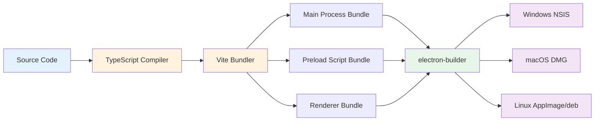

# Technologies Used

## Overview

Notion Backup MD is built with modern web technologies, leveraging Electron to deliver a cross-platform desktop experience with React for the user interface and Node.js for backend operations.

## Core Technology Stack

### Desktop Framework

#### Electron 35.0.0
- **Purpose**: Cross-platform desktop application framework
- **Usage**: Wraps the application to run on Windows, macOS, and Linux
- **Process Model**: Multi-process architecture (main + renderer + preload)
- **Features Used**:
  - IPC (Inter-Process Communication)
  - Native dialogs (folder selection)
  - Application lifecycle management
  - Menu bar integration
  - Native module support

**Why Electron?**
- Write once, deploy everywhere (Windows/macOS/Linux)
- Access to full Node.js ecosystem for backend operations
- Secure sandboxing for untrusted UI code
- Mature ecosystem with extensive tooling

### Frontend Framework

#### React 18.3.1
- **Purpose**: UI component library
- **Usage**: Building the dashboard and settings interface
- **Features Used**:
  - Functional components with hooks (`useState`, `useEffect`)
  - Event handling for user interactions
  - Conditional rendering
  - Real-time state updates

#### React Router DOM 6.30.0
- **Purpose**: Client-side routing
- **Usage**: Navigation between Dashboard and Settings pages
- **Features Used**:
  - Hash-based routing (required for Electron file:// protocol)
  - NavLink with active state styling
  - Programmatic navigation

### Language

#### TypeScript 5.6.2
- **Purpose**: Type-safe JavaScript with compile-time checks
- **Usage**: Entire codebase (main, preload, renderer)
- **Benefits**:
  - Catch errors at compile time, not runtime
  - IntelliSense and autocomplete in IDEs
  - Self-documenting code through type definitions
  - Refactoring confidence
- **Configuration**:
  - Separate `tsconfig.json` for main and renderer processes
  - Strict mode enabled
  - ES2022 target for modern JavaScript features

### Build Tools

#### Vite 6.2.0
- **Purpose**: Fast development server and build tool
- **Usage**: Frontend bundling and hot module replacement
- **Features**:
  - Lightning-fast HMR (Hot Module Replacement)
  - Optimized production builds
  - Native ES modules support
  - CSS processing

#### electron-vite 2.3.0
- **Purpose**: Vite integration for Electron
- **Usage**: Unified build process for main, preload, and renderer
- **Benefits**:
  - Separate builds for each Electron process
  - Development mode with automatic reloading
  - Production optimizations

#### electron-builder 25.1.8
- **Purpose**: Application packaging and distribution
- **Usage**: Creates installers for Windows, macOS, and Linux
- **Output Formats**:
  - Windows: NSIS installer (.exe)
  - macOS: DMG disk image (.dmg)
  - Linux: AppImage (.AppImage) and Debian package (.deb)

### Backend Technologies

#### Node.js (via Electron)
- **Purpose**: Backend runtime environment
- **Usage**: Main process operations
- **Features Used**:
  - File system operations (`fs/promises`)
  - Path manipulation (`path` module)
  - Process management
  - Cron scheduling

#### better-sqlite3 11.10.0
- **Purpose**: Embedded SQL database
- **Usage**: Storing settings, backup jobs, and page records
- **Features**:
  - Synchronous API (simpler than async for desktop apps)
  - WAL (Write-Ahead Logging) mode for concurrent access
  - Native C++ implementation (fast)
  - Zero configuration
- **Native Module**: Requires recompilation against Electron runtime via `electron-rebuild`

#### node-cron 3.0.3
- **Purpose**: Cron-based task scheduling
- **Usage**: Scheduled automatic backups
- **Features**:
  - Standard cron expression syntax (`* * * * *`)
  - Timezone support
  - Expression validation
  - Task start/stop control

### External APIs

#### @notionhq/client 2.2.15
- **Purpose**: Official Notion API JavaScript client
- **Usage**: Fetching pages and blocks from Notion workspaces
- **Features Used**:
  - `client.search()` - Find workspace-level pages
  - `client.pages.retrieve()` - Get page metadata
  - `client.blocks.children.list()` - Fetch page content with pagination
- **Authentication**: Bearer token (Notion integration token)

### Development Tools

#### ESLint 9.17.0
- **Purpose**: JavaScript/TypeScript linting
- **Usage**: Code quality and style enforcement
- **Plugins**:
  - `@typescript-eslint` - TypeScript-specific rules
  - `eslint-plugin-react` - React best practices
- **Configuration**: Flat config format (ESLint 9+)

#### Prettier 3.4.2
- **Purpose**: Code formatting
- **Usage**: Consistent code style across the codebase
- **Integration**: Works alongside ESLint for formatting

#### electron-toolkit 3.2.0
- **Purpose**: Electron development utilities
- **Usage**:
  - Preload script scaffolding
  - TypeScript types for Electron APIs
  - Development optimizations

## Technology Matrix

| Category | Technology | Version | Purpose |
|----------|-----------|---------|---------|
| **Desktop Framework** | Electron | 35.0.0 | Cross-platform desktop app |
| **UI Framework** | React | 18.3.1 | Component-based UI |
| **Routing** | React Router DOM | 6.30.0 | Client-side navigation |
| **Language** | TypeScript | 5.6.2 | Type-safe JavaScript |
| **Build Tool** | Vite | 6.2.0 | Fast bundler + dev server |
| **Electron Build** | electron-vite | 2.3.0 | Electron-specific builds |
| **Packaging** | electron-builder | 25.1.8 | App distribution |
| **Database** | better-sqlite3 | 11.10.0 | Embedded SQL database |
| **Scheduling** | node-cron | 3.0.3 | Cron-based task scheduler |
| **Notion API** | @notionhq/client | 2.2.15 | Official Notion client |
| **Linting** | ESLint | 9.17.0 | Code quality |
| **Formatting** | Prettier | 3.4.2 | Code style |

## Architecture Decisions

### Why Electron?

**Pros**:
- Single codebase for all platforms
- Access to full Node.js ecosystem (SQLite, filesystem, cron)
- Familiar web technologies (HTML/CSS/JavaScript)
- Large community and extensive tooling

**Cons**:
- Larger application size (~150MB with bundled Chromium)
- Higher memory usage than native apps

**Verdict**: Benefits outweigh costs for a desktop backup tool requiring local file access and database operations.

### Why SQLite?

**Alternatives Considered**: JSON files, LevelDB, PostgreSQL

**Chosen Because**:
- Zero configuration (no server setup)
- ACID transactions for data integrity
- Excellent query performance for local data
- Built-in backup job and page history tracking
- SQL provides flexible querying capabilities

### Why React?

**Alternatives Considered**: Vue, Svelte, vanilla JavaScript

**Chosen Because**:
- Large ecosystem with extensive libraries
- Mature tooling and TypeScript support
- Hooks API simplifies state management
- Team familiarity (if applicable)

### Why TypeScript?

**Alternatives Considered**: JavaScript with JSDoc

**Chosen Because**:
- Compile-time error detection prevents bugs
- Better IDE support (autocomplete, refactoring)
- Self-documenting code through type annotations
- Easier to maintain as codebase grows

## Native Module Handling

### better-sqlite3 Compilation

The `better-sqlite3` package is a native C++ module that must be compiled against Electron's Node.js runtime:

**Configuration** (`.npmrc`):
```ini
runtime=electron
target=35.0.0
disturl=https://electronjs.org/headers
build_from_source=true
```

**Build Commands**:
- `npm install` - Automatically fetches Electron-specific prebuilds
- `npm run rebuild` - Recompile if prebuilds fail or Electron version changes

**Why This Matters**: Using Node.js prebuilds in Electron will cause crashes at runtime. The `.npmrc` ensures correct binaries are installed.

## Development Workflow

### Commands

| Command | Purpose |
|---------|---------|
| `npm run dev` | Start Electron in development mode with hot reload |
| `npm run build` | Compile TypeScript and bundle for production |
| `npm run preview` | Preview production build before packaging |
| `npm run typecheck` | Type-check main and renderer separately |
| `npm run lint` | Run ESLint on all `.ts`/`.tsx` files |
| `npm run format` | Format code with Prettier |
| `npm run rebuild` | Recompile native modules for Electron |

### Development Mode Features

**Hot Module Replacement (HMR)**:
- Renderer process changes reload instantly without restarting Electron
- Main process changes trigger full app restart
- Preserves application state where possible

**DevTools**:
- Chrome DevTools available in renderer process (F12)
- React DevTools integration for component inspection
- Network tab for debugging IPC communication

### Build Process



## Security Considerations

### Process Isolation

- **Main Process**: Full access to Node.js APIs and file system
- **Preload Script**: Limited bridge between processes
- **Renderer Process**: Sandboxed web environment with NO direct Node.js access

### Context Isolation

Enabled via `contextBridge.exposeInMainWorld()` to prevent renderer code from accessing internal Electron APIs.

### Content Security Policy (CSP)

TypeScript compilation ensures no unsafe code patterns (e.g., `eval()`, inline scripts).

## Performance Optimizations

### Database

- WAL mode enables concurrent reads during backups
- Indexes on `job_id` and `notion_id` for fast queries
- Prepared statements prevent SQL injection

### Frontend

- React component memoization where needed
- Debounced settings saves
- Lazy loading of backup history (only last 50 jobs)

### Build

- Tree shaking removes unused code
- Minification reduces bundle size
- Code splitting separates main/renderer/preload bundles

## Dependency Management

**Package Manager**: npm (bundled with Node.js)

**Lock File**: `package-lock.json` ensures reproducible builds

**Update Strategy**:
- Regular security updates via `npm audit`
- Major version upgrades tested in isolation
- Electron version updates require native module rebuild

## Platform-Specific Considerations

### Windows
- NSIS installer with auto-update support
- App data stored in `%APPDATA%/Notion Backup MD/`

### macOS
- DMG disk image for drag-and-drop installation
- Code signing required for Gatekeeper (future enhancement)
- App data stored in `~/Library/Application Support/Notion Backup MD/`

### Linux
- AppImage for universal compatibility (no installation required)
- Debian package for Debian/Ubuntu users
- App data stored in `~/.config/Notion Backup MD/`

## Future Technology Considerations

### Potential Additions

- **Electron Forge**: Alternative to electron-builder for more control
- **Zustand/Redux**: State management if UI complexity grows
- **Tailwind CSS**: Utility-first CSS framework for faster styling
- **Vitest**: Fast unit testing framework
- **Playwright**: End-to-end testing for Electron apps

### Extensibility Hooks

The current architecture supports:
- Multiple source providers (implement `ISourceProvider`)
- Multiple storage backends (implement `IStorage`)
- Custom Markdown converters
- Plugin system for post-processing content

## Summary

Notion Backup MD leverages a modern, well-established technology stack that balances:
- **Developer Experience**: TypeScript, React, Vite provide fast iteration
- **Performance**: Native SQLite, efficient bundling, process isolation
- **Reliability**: Type safety, ACID transactions, error handling
- **Maintainability**: Clear architecture, documented APIs, consistent tooling
- **Extensibility**: Interface-based design for future enhancements

The choice of Electron enables true cross-platform delivery without sacrificing access to powerful Node.js capabilities like filesystem operations and database management.
