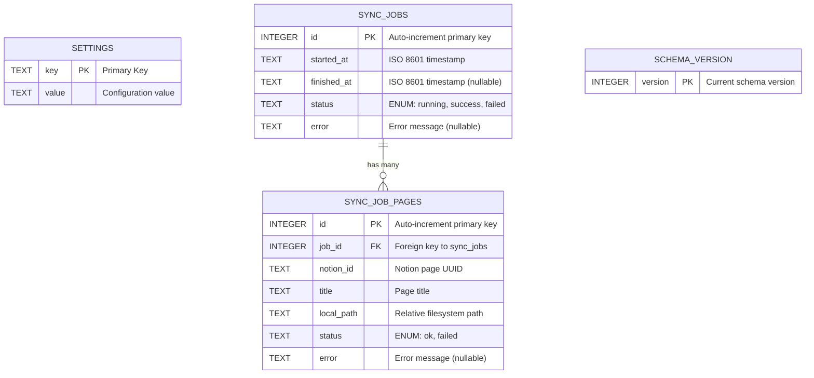
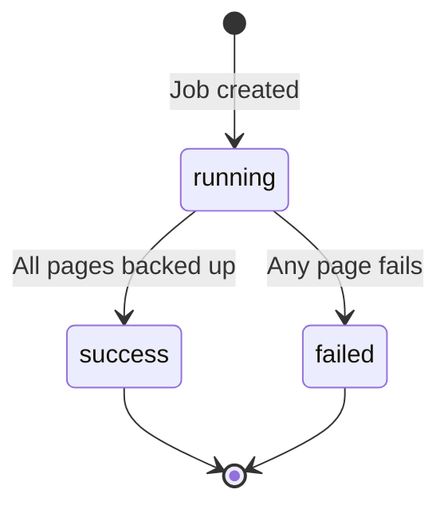
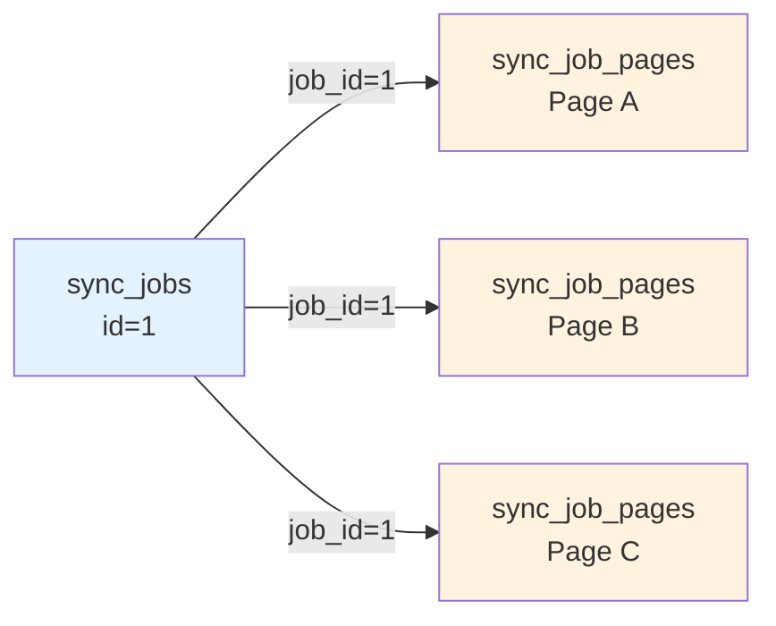

# Database Entities

## Overview

Notion Backup MD uses **SQLite** as its embedded database, stored at the Electron user data path (`app.getPath('userData')/notion-backup.db`). The database uses **WAL (Write-Ahead Logging)** mode for safe concurrent access during backups.

## Database Location by Platform

| Platform | Path |
|----------|------|
| **Windows** | `%APPDATA%\Notion Backup MD\notion-backup.db` |
| **macOS** | `~/Library/Application Support/Notion Backup MD/notion-backup.db` |
| **Linux** | `~/.config/Notion Backup MD/notion-backup.db` |

## Entity-Relationship Diagram



## Tables

### 1. settings

**Purpose**: Key-value store for application configuration

**Schema**:
```sql
CREATE TABLE settings (
  key   TEXT PRIMARY KEY,
  value TEXT NOT NULL
);
```

**Columns**:

| Column | Type | Constraints | Description |
|--------|------|-------------|-------------|
| `key` | TEXT | PRIMARY KEY | Setting identifier (unique) |
| `value` | TEXT | NOT NULL | Setting value (all values stored as text) |

**Data**:

| Key | Value Type | Example | Description |
|-----|------------|---------|-------------|
| `notionToken` | string | `secret_AbC...XyZ` | Notion integration token |
| `backupRootPath` | string | `/Users/me/notion-backups` | Local directory for backups |
| `scheduleEnabled` | boolean | `'true'` or `'false'` | Enable/disable scheduled backups |
| `scheduleCron` | string | `'0 2 * * *'` | Cron expression (daily at 2 AM) |

**Notes**:
- Boolean values stored as strings `'true'` or `'false'`
- No default values in schema; defaults handled in application code
- Type-safe access via `src/main/db/settings.ts` module

**Access Patterns**:
```typescript
// Get all settings
const settings = await getAllSettings();
// Returns: { notionToken: '...', backupRootPath: '...', ... }

// Set a single setting
await setSetting('scheduleEnabled', true);
```

---

### 2. sync_jobs

**Purpose**: Track backup job execution history

**Schema**:
```sql
CREATE TABLE sync_jobs (
  id          INTEGER PRIMARY KEY AUTOINCREMENT,
  started_at  TEXT NOT NULL,
  finished_at TEXT,
  status      TEXT NOT NULL CHECK(status IN ('running','success','failed')),
  error       TEXT
);
```

**Columns**:

| Column | Type | Constraints | Description |
|--------|------|-------------|-------------|
| `id` | INTEGER | PRIMARY KEY AUTOINCREMENT | Unique job identifier |
| `started_at` | TEXT | NOT NULL | ISO 8601 timestamp when backup started |
| `finished_at` | TEXT | NULLABLE | ISO 8601 timestamp when backup completed |
| `status` | TEXT | NOT NULL, CHECK constraint | Job status: `'running'`, `'success'`, or `'failed'` |
| `error` | TEXT | NULLABLE | Error message if status is `'failed'` |

**Status Values**:

| Status | Meaning | `finished_at` | `error` |
|--------|---------|---------------|---------|
| `running` | Backup in progress | `NULL` | `NULL` |
| `success` | Backup completed successfully | Timestamp | `NULL` |
| `failed` | Backup encountered errors | Timestamp | Error message |

**Lifecycle**:


**Example Data**:
```sql
INSERT INTO sync_jobs (id, started_at, finished_at, status, error) VALUES
  (1, '2025-01-15T02:00:00.000Z', '2025-01-15T02:05:23.456Z', 'success', NULL),
  (2, '2025-01-16T02:00:00.000Z', '2025-01-16T02:00:15.123Z', 'failed', 'Notion API rate limit exceeded'),
  (3, '2025-01-17T14:30:00.000Z', NULL, 'running', NULL);
```

**Queries**:
```sql
-- Get last 50 backup jobs ordered by most recent
SELECT * FROM sync_jobs ORDER BY started_at DESC LIMIT 50;

-- Count successful backups in last 7 days
SELECT COUNT(*) FROM sync_jobs
WHERE status = 'success'
  AND started_at > datetime('now', '-7 days');
```

---

### 3. sync_job_pages

**Purpose**: Track individual page backup results within each job

**Schema**:
```sql
CREATE TABLE sync_job_pages (
  id          INTEGER PRIMARY KEY AUTOINCREMENT,
  job_id      INTEGER NOT NULL REFERENCES sync_jobs(id),
  notion_id   TEXT NOT NULL,
  title       TEXT NOT NULL,
  local_path  TEXT NOT NULL,
  status      TEXT NOT NULL CHECK(status IN ('ok','failed')),
  error       TEXT
);
```

**Columns**:

| Column | Type | Constraints | Description |
|--------|------|-------------|-------------|
| `id` | INTEGER | PRIMARY KEY AUTOINCREMENT | Unique page record identifier |
| `job_id` | INTEGER | NOT NULL, FOREIGN KEY | References `sync_jobs.id` |
| `notion_id` | TEXT | NOT NULL | Notion page UUID (e.g., `abc123-...`) |
| `title` | TEXT | NOT NULL | Page title at time of backup |
| `local_path` | TEXT | NOT NULL | Relative path from backup root |
| `status` | TEXT | NOT NULL, CHECK constraint | Page status: `'ok'` or `'failed'` |
| `error` | TEXT | NULLABLE | Error message if status is `'failed'` |

**Relationship**:
- Each `sync_job` has many `sync_job_pages` (one-to-many)
- Foreign key constraint ensures referential integrity

**Example Data**:
```sql
INSERT INTO sync_job_pages (id, job_id, notion_id, title, local_path, status, error) VALUES
  (1, 1, 'abc-123', 'Project Documentation', 'Project Documentation', 'ok', NULL),
  (2, 1, 'def-456', 'Meeting Notes', 'Meeting Notes', 'ok', NULL),
  (3, 2, 'ghi-789', 'Roadmap', 'Roadmap', 'failed', 'Network timeout fetching blocks');
```

**Queries**:
```sql
-- Get all pages for a specific job
SELECT * FROM sync_job_pages WHERE job_id = 1;

-- Find failed pages in last backup
SELECT * FROM sync_job_pages
WHERE job_id = (SELECT id FROM sync_jobs ORDER BY started_at DESC LIMIT 1)
  AND status = 'failed';

-- Count total pages backed up successfully
SELECT COUNT(*) FROM sync_job_pages WHERE status = 'ok';
```

---

### 4. schema_version

**Purpose**: Track database schema version for migrations

**Schema**:
```sql
CREATE TABLE schema_version (
  version INTEGER PRIMARY KEY
);
```

**Columns**:

| Column | Type | Constraints | Description |
|--------|------|-------------|-------------|
| `version` | INTEGER | PRIMARY KEY | Current schema version number |

**Usage**:
- Migration system in `src/main/db/migrations.ts` maintains version
- Always contains exactly 1 row with current version
- Prevents applying migrations multiple times

**Current Version**: `1` (initial schema)

**Example Data**:
```sql
INSERT INTO schema_version (version) VALUES (1);
```

---

## Database Relationships

### One-to-Many: sync_jobs → sync_job_pages



**Join Query**:
```sql
-- Get job with all its pages
SELECT
  j.id AS job_id,
  j.started_at,
  j.status AS job_status,
  p.title AS page_title,
  p.local_path,
  p.status AS page_status
FROM sync_jobs j
LEFT JOIN sync_job_pages p ON j.id = p.job_id
WHERE j.id = 1;
```

---

## Indexes

**Current**: No explicit indexes defined (using primary keys only)

**Recommended for Production**:
```sql
-- Speed up job history queries
CREATE INDEX idx_sync_jobs_started_at ON sync_jobs(started_at DESC);

-- Speed up page lookups by Notion ID
CREATE INDEX idx_sync_job_pages_notion_id ON sync_job_pages(notion_id);

-- Speed up job-page joins
CREATE INDEX idx_sync_job_pages_job_id ON sync_job_pages(job_id);
```

---

## Migration System

**Location**: `src/main/db/migrations.ts`

**Structure**:
```typescript
const migrations = [
  `CREATE TABLE settings (...);
   CREATE TABLE sync_jobs (...);
   CREATE TABLE sync_job_pages (...);
   CREATE TABLE schema_version (version INTEGER PRIMARY KEY);
   INSERT INTO schema_version (version) VALUES (1);`
];
```

**Process**:
1. On app startup, `initDatabase()` reads current `schema_version`
2. Apply all migrations with version > current version
3. Update `schema_version` to latest

**Adding New Migrations**:
```typescript
// Add to migrations array:
const migrations = [
  `/* v1 schema */`,
  `/* v2: Add new column */
   ALTER TABLE sync_jobs ADD COLUMN duration INTEGER;
   UPDATE schema_version SET version = 2;`
];
```

---

## Data Integrity

### Constraints

- **Primary Keys**: Ensure unique identifiers
- **Foreign Keys**: Maintain referential integrity (job deletion cascades to pages)
- **CHECK Constraints**: Enforce valid status values
- **NOT NULL**: Prevent missing critical data

### Transaction Safety

- All backup operations wrapped in transactions
- WAL mode allows concurrent reads during writes
- Atomic job creation: `INSERT sync_jobs` → process pages → `UPDATE sync_jobs`

### Error Scenarios

| Scenario | Behavior |
|----------|----------|
| App crashes during backup | Job remains in `'running'` status (manual cleanup needed) |
| Page fetch fails | Record `'failed'` in `sync_job_pages`, continue with other pages |
| All pages fail | Job status set to `'failed'` with error message |
| Database locked | WAL mode prevents most locking issues |

---

## Database Access Patterns

### Read Operations

**Settings** (frequent):
- `getSetting(key)` - Single setting lookup
- `getAllSettings()` - Load all settings on app startup

**Jobs** (infrequent):
- `getJobHistory()` - Last 50 jobs for dashboard display
- `getJobById(id)` - Specific job details with pages

### Write Operations

**Settings** (rare):
- `setSetting(key, value)` - User changes configuration

**Jobs** (periodic):
- `createJob()` - Start new backup
- `updateJob(id, status, error)` - Complete backup
- `recordPageResult(job_id, page_data)` - Log each page result

### Performance Characteristics

| Operation | Frequency | Performance |
|-----------|-----------|-------------|
| Read settings | Every backup start | O(1) with primary key |
| Write settings | User interaction | O(1) update |
| Create job | Per backup | O(1) insert |
| Record page | Per page in backup | O(1) insert |
| Load history | Dashboard load | O(n) scan, limited to 50 rows |

---

## Database Size Estimation

**Per Backup Job**:
- 1 `sync_jobs` row: ~100 bytes
- 1 `sync_job_pages` row per page: ~200 bytes

**Example**:
- Workspace with 500 pages
- Daily backups for 1 year
- **Size**: ~365 jobs × (100 + 500×200) = **36 MB**

**Retention Strategy** (future enhancement):
- Keep last N backups (e.g., 100)
- Archive or delete older job records
- Maintain settings indefinitely

---

## Type Safety

TypeScript interfaces match database schema:

```typescript
// src/main/db/types.ts (example)
interface SyncJob {
  id: number;
  started_at: string;  // ISO 8601
  finished_at: string | null;
  status: 'running' | 'success' | 'failed';
  error: string | null;
}

interface SyncJobPage {
  id: number;
  job_id: number;
  notion_id: string;
  title: string;
  local_path: string;
  status: 'ok' | 'failed';
  error: string | null;
}
```

---

## Summary

The database schema is:
- **Simple**: Only 4 tables with clear relationships
- **Normalized**: No redundant data, foreign keys enforce integrity
- **Extensible**: Easy to add columns or tables via migrations
- **Performant**: Primary keys and potential indexes support fast queries
- **Safe**: ACID transactions and constraints prevent data corruption

The design supports both manual and scheduled backups while maintaining a complete audit trail of all backup operations and individual page results.
