# Main Workflows

## Overview

This document describes the primary workflows in Notion Backup MD, from user interactions to scheduled automation. Each workflow is illustrated with sequence diagrams showing the interactions between components.

---

## 1. Application Startup

### Purpose
Initialize the application, database, and scheduler when the user launches the app.

### Sequence Diagram

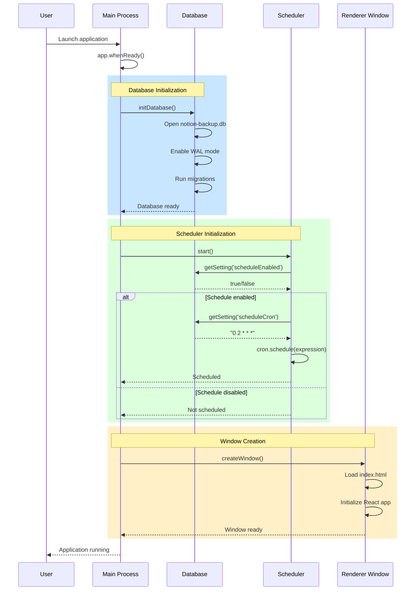

### Steps

1. **Electron App Ready**: `app.whenReady()` event fires
2. **Database Initialization**:
   - Open SQLite database file
   - Enable WAL (Write-Ahead Logging) mode
   - Apply any pending schema migrations
   - Create tables if first run
3. **IPC Handler Registration**: Register all IPC channels for renderer communication
4. **Scheduler Startup**:
   - Read `scheduleEnabled` and `scheduleCron` settings
   - If enabled, create cron task
5. **Window Creation**:
   - Create BrowserWindow with preload script
   - Load React application (index.html)
6. **Renderer Initialization**:
   - Load settings from main process
   - Fetch backup history
   - Display dashboard

### Error Handling

| Error | Behavior |
|-------|----------|
| Database file corrupted | Log error, create new database |
| Invalid cron expression | Skip scheduling, continue startup |
| Window creation fails | Retry once, then exit app |

---

## 2. Manual Backup Workflow

### Purpose
User manually triggers a backup from the Dashboard page.

### Sequence Diagram

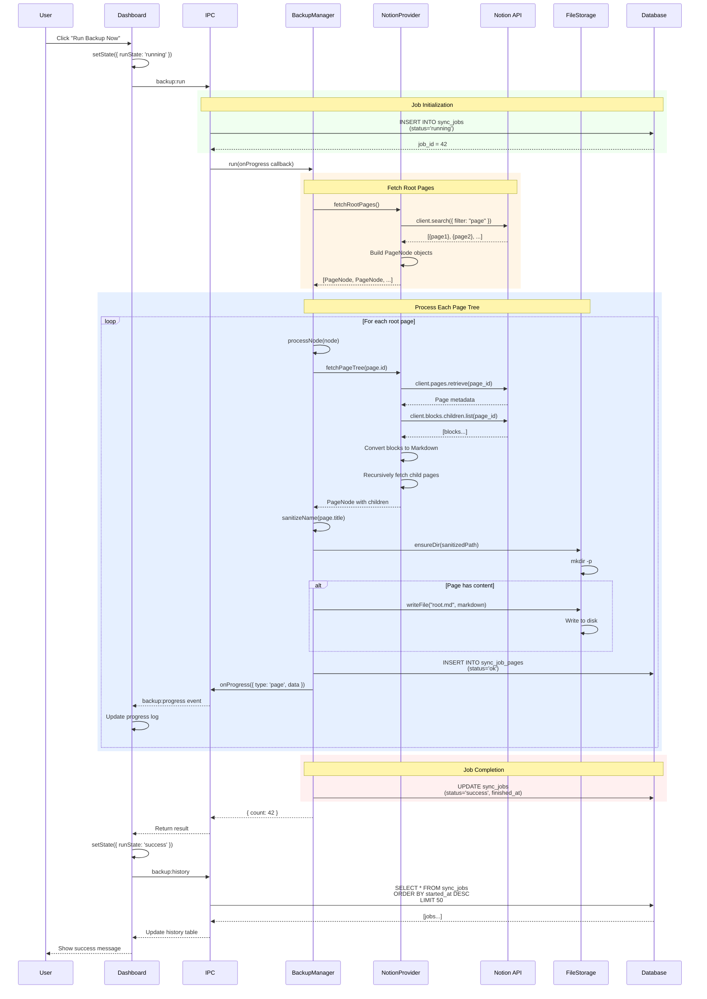

### Steps

1. **User Initiates**:
   - Click "Run Backup Now" button
   - Button becomes disabled
   - Progress log appears

2. **Job Creation**:
   - Create `sync_jobs` record with `status='running'`
   - Store `started_at` timestamp

3. **Fetch Root Pages**:
   - Call Notion API's `search()` to find workspace-level pages
   - Convert to `PageNode` objects

4. **Process Each Page**:
   - **Fetch content**: Get page blocks from Notion API
   - **Convert to Markdown**: Transform Notion blocks to Markdown syntax
   - **Sanitize filename**: Remove invalid characters
   - **Create directory**: Make folder matching page hierarchy
   - **Write file**: Save `root.md` if page has content
   - **Record result**: Insert `sync_job_pages` entry
   - **Emit progress**: Send event to renderer for real-time updates
   - **Recurse children**: Process child pages in same directory

5. **Job Completion**:
   - Update `sync_jobs` with `status='success'` and `finished_at`
   - Return total page count

6. **UI Update**:
   - Display success message
   - Refresh history table
   - Re-enable backup button

### Progress Events

```typescript
// Sent to renderer during backup
type BackupProgress =
  | { type: 'start'; data: { message: string } }
  | { type: 'page'; data: { title: string; path: string } }
  | { type: 'error'; data: { message: string; pageTitle?: string } }
  | { type: 'complete'; data: { count: number } }
```

### Error Scenarios

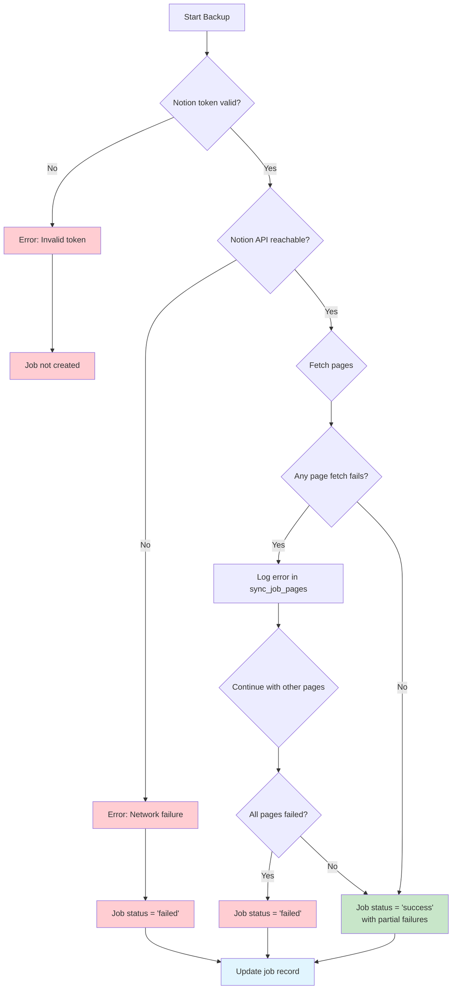

---

## 3. Scheduled Backup Workflow

### Purpose
Automatically run backups at scheduled times based on cron expression.

### Sequence Diagram

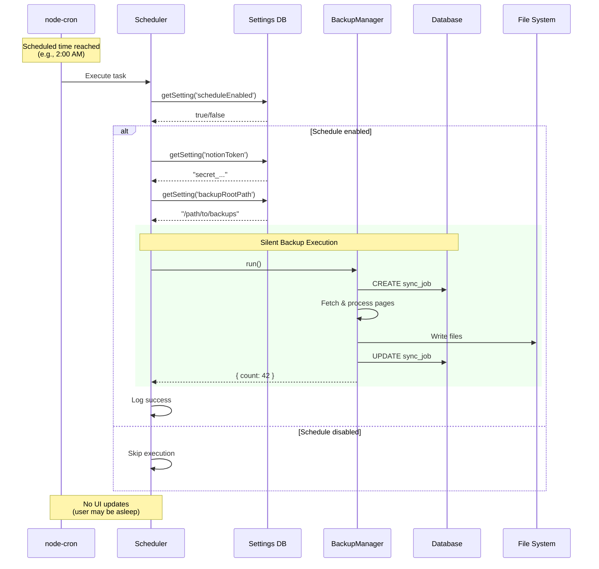

### Steps

1. **Cron Trigger**:
   - `node-cron` fires at scheduled time
   - Example: `"0 2 * * *"` = Every day at 2:00 AM

2. **Settings Check**:
   - Verify `scheduleEnabled` is still `true`
   - Load `notionToken` and `backupRootPath`

3. **Silent Backup**:
   - Execute same backup process as manual backup
   - **No progress events** sent to renderer (window may be closed)
   - All results recorded in database

4. **Logging**:
   - Log success/failure to console
   - Job record in database serves as audit trail

### Difference from Manual Backup

| Aspect | Manual Backup | Scheduled Backup |
|--------|---------------|------------------|
| **Trigger** | User click | Cron timer |
| **UI Updates** | Real-time progress events | None |
| **User Feedback** | Success toast + history refresh | Silent (check history later) |
| **Error Display** | Immediate error dialog | Recorded in database only |

### Schedule Management

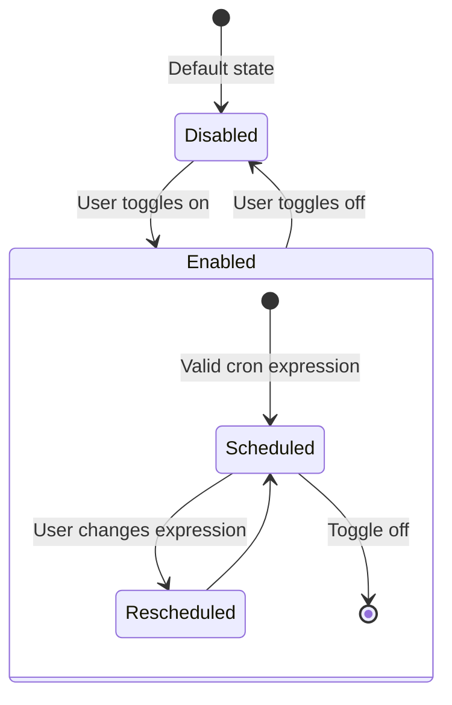

---

## 4. Settings Management Workflow

### Purpose
User updates application configuration (Notion token, backup path, schedule).

### Sequence Diagram

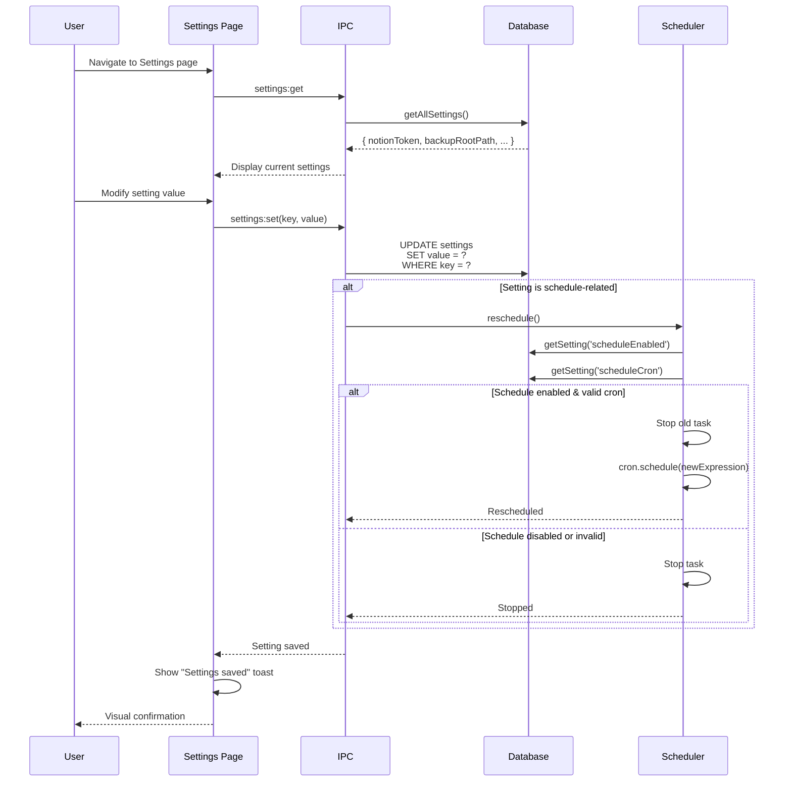

### Settings

| Setting | Type | Example | Triggers Reschedule? |
|---------|------|---------|---------------------|
| `notionToken` | string | `secret_AbC...XyZ` | No |
| `backupRootPath` | string | `/home/user/backups` | No |
| `scheduleEnabled` | boolean | `true` | **Yes** |
| `scheduleCron` | string | `0 2 * * *` | **Yes** |

### Cron Expression Examples

| Expression | Meaning |
|------------|---------|
| `0 2 * * *` | Daily at 2:00 AM |
| `0 */6 * * *` | Every 6 hours |
| `0 0 * * 0` | Every Sunday at midnight |
| `30 14 * * 1-5` | Weekdays at 2:30 PM |

### Validation Flow

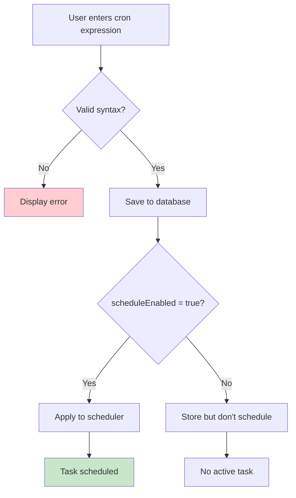

### Directory Selection

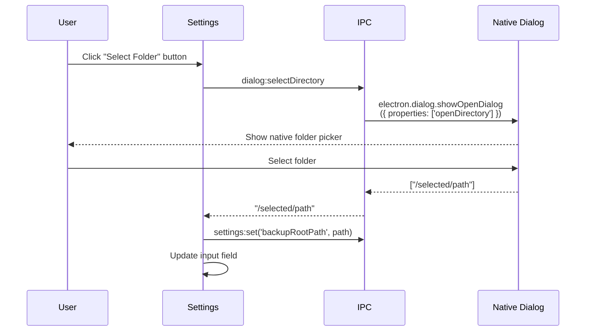

---

## 5. Backup History Viewing

### Purpose
Display past backup jobs with timestamps, status, and error messages.

### Sequence Diagram

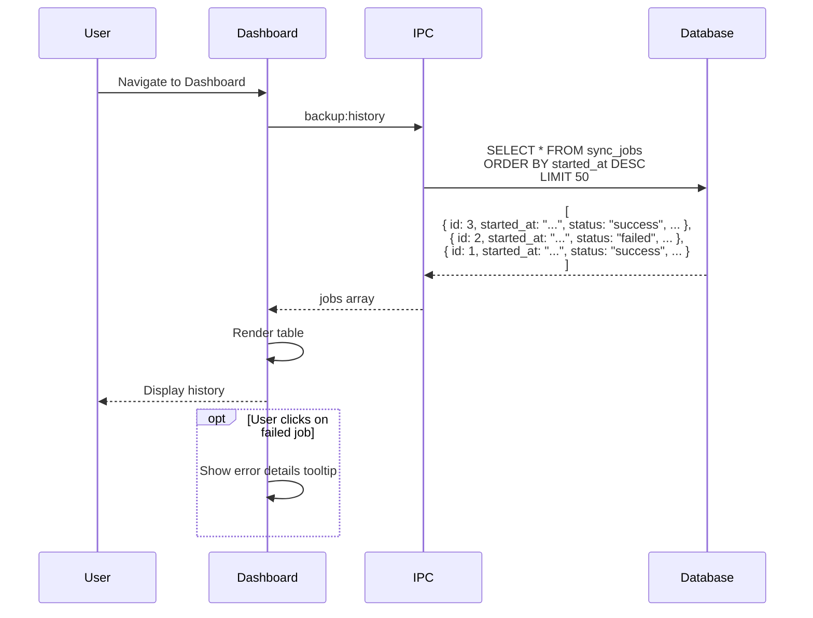

### History Table Columns

| Column | Data | Example |
|--------|------|---------|
| **ID** | Job identifier | `#42` |
| **Started At** | Formatted timestamp | `Jan 15, 2025 2:00 AM` |
| **Finished At** | Formatted timestamp | `Jan 15, 2025 2:05 AM` |
| **Duration** | Calculated | `5m 23s` |
| **Status** | Badge | 🟢 Success / 🔴 Failed / 🟡 Running |
| **Pages** | Page count | `42 pages` |
| **Error** | Error message (if failed) | `Notion API rate limit` |

### Status Indicators

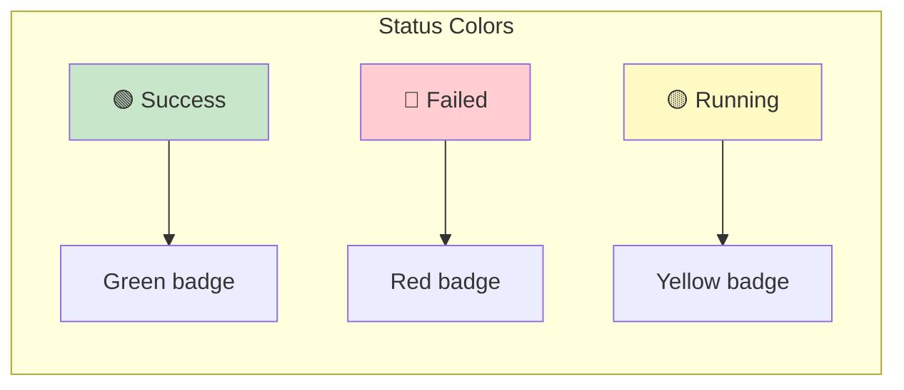

---

## 6. Page Hierarchy to Filesystem Mapping

### Purpose
Transform Notion's nested page structure into a corresponding directory hierarchy.

### Transformation Flow

```mermaid
graph TD
    A[Notion Workspace] --> B{Fetch root pages}
    B --> C[Page: Project Docs]
    B --> D[Page: Meeting Notes]

    C --> E{Fetch children}
    E --> F[Child: Architecture]
    E --> G[Child: API Reference]

    F --> H{Fetch children}
    H --> I[Grandchild: Diagrams]

    subgraph Filesystem Output
        J[/backup-root/]
        K[/Project Docs/]
        L[/Project Docs/root.md]
        M[/Project Docs/Architecture/]
        N[/Project Docs/Architecture/root.md]
        O[/Project Docs/Architecture/Diagrams/]
        P[/Project Docs/Architecture/Diagrams/root.md]
        Q[/Meeting Notes/]
        R[/Meeting Notes/root.md]
    end

    C --> K
    C --> L
    F --> M
    F --> N
    I --> O
    I --> P
    D --> Q
    D --> R

    style J fill:#e3f2fd
    style K fill:#e3f2fd
    style L fill:#fff3e0
    style M fill:#e3f2fd
    style N fill:#fff3e0
    style O fill:#e3f2fd
    style P fill:#fff3e0
    style Q fill:#e3f2fd
    style R fill:#fff3e0
```

### Filename Sanitization

```mermaid
graph LR
    A["Input: 'Project/Plan: 2025 *DRAFT*'"] --> B[Remove: / \ : * ? \" < > |]
    B --> C["'Project Plan 2025 DRAFT'"]
    C --> D[Collapse multiple spaces]
    D --> E["'Project Plan 2025 DRAFT'"]
    E --> F[Trim whitespace]
    F --> G[Limit to 200 chars]
    G --> H["Output: 'Project Plan 2025 DRAFT'"]

    style A fill:#ffcdd2
    style H fill:#c8e6c9
```

### Page Processing Algorithm

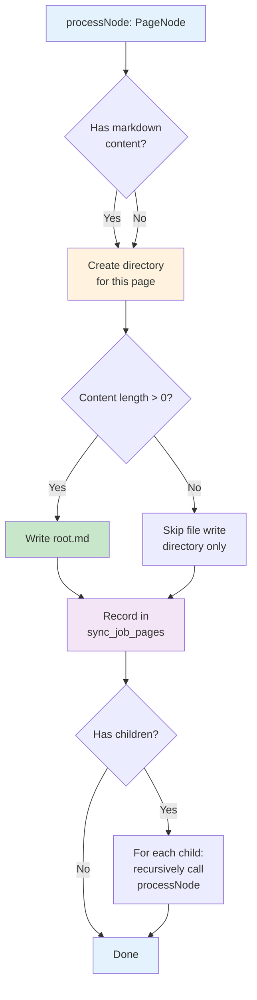

---

## 7. Notion Block to Markdown Conversion

### Purpose
Convert Notion's proprietary block format to standard Markdown.

### Supported Block Types

```mermaid
graph LR
    subgraph "Notion Blocks"
        NB1[paragraph]
        NB2[heading_1/2/3]
        NB3[bulleted_list_item]
        NB4[numbered_list_item]
        NB5[to_do]
        NB6[code]
        NB7[quote]
        NB8[divider]
    end

    subgraph "Markdown Output"
        MD1[Plain text]
        MD2[# / ## / ###]
        MD3[- item]
        MD4[1. item]
        MD5[- [ ] / - [x]]
        MD6[```lang<br/>code<br/>```]
        MD7[> quote]
        MD8[---]
    end

    NB1 --> MD1
    NB2 --> MD2
    NB3 --> MD3
    NB4 --> MD4
    NB5 --> MD5
    NB6 --> MD6
    NB7 --> MD7
    NB8 --> MD8

    style NB1 fill:#e3f2fd
    style NB2 fill:#e3f2fd
    style NB3 fill:#e3f2fd
    style NB4 fill:#e3f2fd
    style NB5 fill:#e3f2fd
    style NB6 fill:#e3f2fd
    style NB7 fill:#e3f2fd
    style NB8 fill:#e3f2fd

    style MD1 fill:#c8e6c9
    style MD2 fill:#c8e6c9
    style MD3 fill:#c8e6c9
    style MD4 fill:#c8e6c9
    style MD5 fill:#c8e6c9
    style MD6 fill:#c8e6c9
    style MD7 fill:#c8e6c9
    style MD8 fill:#c8e6c9
```

### Conversion Examples

**Paragraph**:
```
Notion: { type: "paragraph", paragraph: { rich_text: [{ text: { content: "Hello world" } }] } }
Markdown: Hello world
```

**Heading**:
```
Notion: { type: "heading_2", heading_2: { rich_text: [{ text: { content: "Section" } }] } }
Markdown: ## Section
```

**Code Block**:
```
Notion: { type: "code", code: { language: "javascript", rich_text: [{ text: { content: "const x = 1;" } }] } }
Markdown: ```javascript
const x = 1;
```
```

**To-Do**:
```
Notion: { type: "to_do", to_do: { checked: true, rich_text: [{ text: { content: "Task" } }] } }
Markdown: - [x] Task
```

### Unsupported Blocks

| Block Type | Behavior |
|------------|----------|
| `image` | Skipped (future: download and reference) |
| `file` | Skipped |
| `video` | Skipped |
| `embed` | Skipped |
| `bookmark` | Skipped |
| `table` | Skipped (complex structure) |
| `child_page` | Processed as separate directory |
| `child_database` | Skipped |

---

## 8. Error Handling Workflow

### Purpose
Gracefully handle failures at various stages of the backup process.

### Error Categories

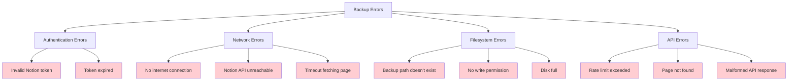

### Error Recovery Strategy

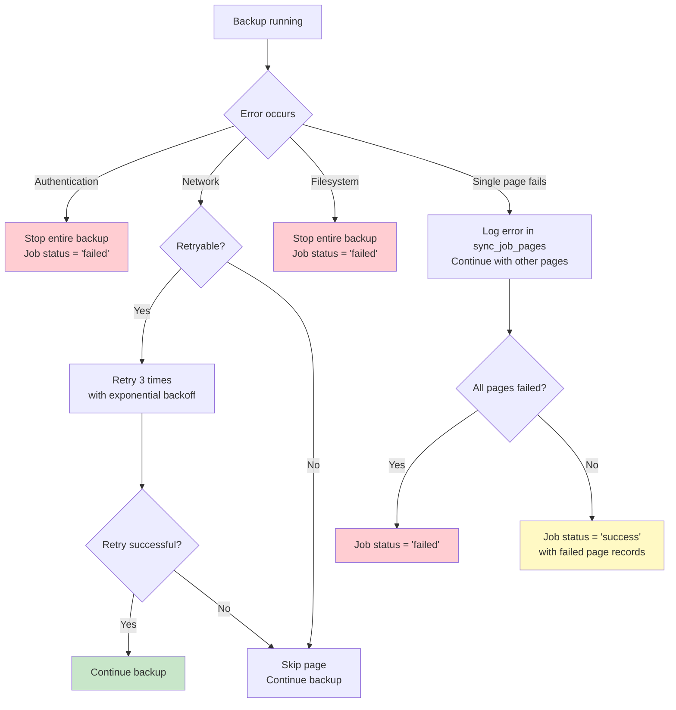

### Error Recording

```sql
-- Failed job example
INSERT INTO sync_jobs (started_at, finished_at, status, error) VALUES
  ('2025-01-15T02:00:00.000Z', '2025-01-15T02:00:05.123Z', 'failed', 'Notion API: Unauthorized (invalid token)');

-- Failed page example
INSERT INTO sync_job_pages (job_id, notion_id, title, local_path, status, error) VALUES
  (42, 'abc-123', 'Roadmap 2025', 'Roadmap 2025', 'failed', 'Network timeout after 3 retries');
```

---

## Summary

The main workflows in Notion Backup MD follow a consistent pattern:

1. **User/System Trigger**: Manual click or scheduled timer
2. **Settings Validation**: Ensure configuration is valid
3. **Database Transaction**: Create job record
4. **Content Fetching**: Call Notion API with pagination
5. **Conversion & Storage**: Transform to Markdown, write to disk
6. **Progress Tracking**: Update database and optionally emit UI events
7. **Completion**: Finalize job record with status

Key design principles:
- **Resilience**: Continue on single-page failures
- **Auditability**: Record all operations in database
- **User Feedback**: Real-time progress for manual backups
- **Automation**: Silent scheduled backups
- **Extensibility**: Plugin architecture for new providers/storage

All workflows maintain data integrity through SQLite transactions and provide detailed error messages for troubleshooting.
